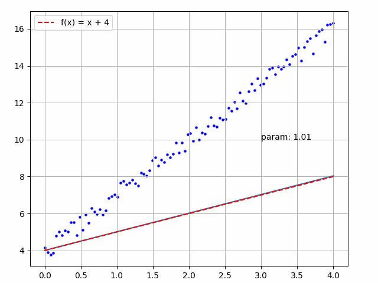
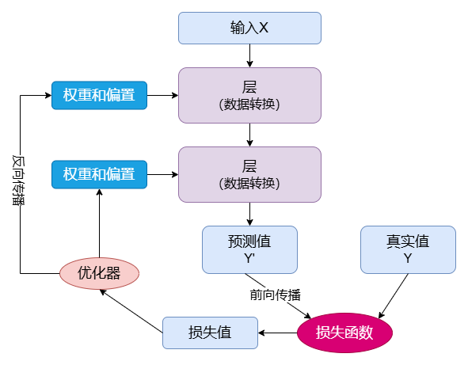
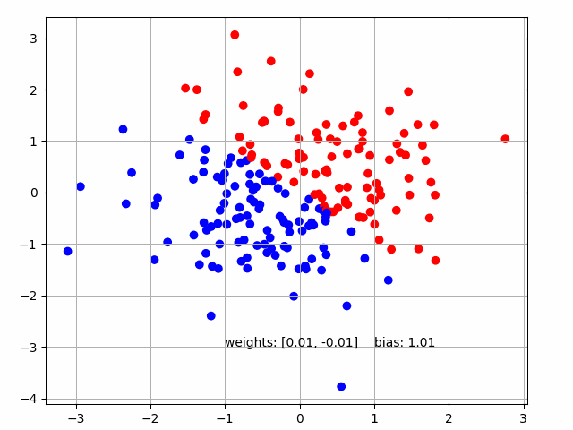
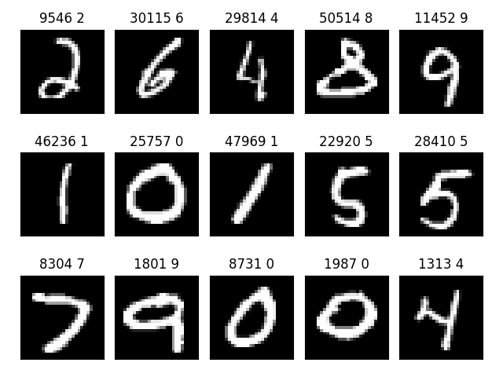

# Machine Learning Series (机器学习系列)

* Python 语言 12 天速成 [ [在线文档](https://docs.google.com/document/d/13dJIhnj4FbxFApRbaxyYz436vsRMAK9FhqPyuqBMY9Q/edit?usp=sharing) ] [ [YouTube 视频](https://www.youtube.com/@machine-learning-series) ]   
* 机器学习 12 天速成  [ [在线文档](https://docs.google.com/document/d/18V6H_600l-drkXd99pjNtSJtA7rIWWnER-KxIrB-lQY/edit?usp=sharing) ] [ [YouTube 视频](https://www.youtube.com/@machine-learning-series) ]   

---

## [机器学习 12 天速成](https://docs.google.com/document/d/18V6H_600l-drkXd99pjNtSJtA7rIWWnER-KxIrB-lQY/edit?usp=sharing)

第 1 天 认识机器学习：绘制直线  
第 2 天 深度学习原理  
第 3 天 二分类问题：Keras 求解  
第 4 天 详解反向传播算法  
第 5 天 MNIST 全连接神经网络  
第 6 天 张量与自动微分  
第 7 天 使用 PyTorch 训练  
第 8 天 卷积神经网络  
第 9 天 AlexNet 卷积模型  
第 10 天 ResNet 残差网络  
第 11 天 注意力机制 (Transformer)  
第 12 天 GPT 大模型 (LLM)  

### 01 认识机器学习：绘制直线
本章将回顾常用函数的基本概念，使用传统解法和机器学习解法，求一条通过 100 个随机分布点的最佳拟合直线，即找到一条直线 `y = m * x + b` 使得所有的点到直线的垂直距离之和（或平方和）最小。



### 02 深度学习原理

了解机器学习与传统编程的区别，理解深度学习原理，熟悉人工神经网络的训练过程，包括数据预处理、权重、损失函数、优化器、反向传播等概念。



### 03 二分类问题：Keras 求解

二分类问题是指在机器学习或统计学中，将数据划分为两个类别的分类任务。常见的二分类问题包括垃圾邮件分类（垃圾邮件与正常邮件）、疾病诊断（有病与无病）、图像分类（有目标与无目标）等。

```
    rng = numpy.random.default_rng(seed=0)
    input = rng.standard_normal((200, 2))
    output = numpy.array([1 if x + y > 0 else 0 for x, y in input])
    model = keras.Sequential()
    model.add(keras.layers.Input(shape=(2,)))
    model.add(keras.layers.Dense(units=1, activation='sigmoid',
                                 kernel_initializer=initializers.Constant(0.0),
                                 bias_initializer=initializers.Constant(1.0)))
    model.summary()
    model.compile(loss='binary_crossentropy',
                  optimizer=optimizers.Adam(learning_rate=0.01), metrics=['accuracy'])
    model.fit(input, output, epochs=5, batch_size=1)
```



### 04 详解反向传播算法

复习导数（求微分）、链式法则、极值、偏导数等微积分概念。理解梯度和导数之间的关系，手写人工神经网络，求解函数 `loss = h(g(f(weights, biases)))` 的最小值（训练网络）。

### 05 MNIST 全连接神经网络

MNIST 是一个入门的机器学习数据集，包含数万张手写数字 (0-9) 的灰度图像。全连接神经网络通常包含输入层、多个隐藏层和输出层，使用反向传播算法训练，从而使网络能够识别数字。



### 06 张量和自动微分

### 07 使用 PyTorch 训练

### 08 卷积神经网络

### 09 AlexNet 模型

### 10 ResNet 残差网络

### 11 注意力机制 (Transformer)

### 12 GPT 大模型 (LLM)

---

## [Python 语言 12 天速成](https://docs.google.com/document/d/13dJIhnj4FbxFApRbaxyYz436vsRMAK9FhqPyuqBMY9Q/edit?usp=sharing)

第 1 天 Python 介绍  
第 2 天 计算机基础  
第 3 天 常量与变量  
第 4 天 控制流  
第 5 天 函数详解  
第 6 天 实战：Android 控制  
第 7 天 数据结构与算法  
第 8 天 面向对象  
第 9 天 标准库  
第 10 天 实战：绘制跳动的爱心  
第 11 天 实战：WAVE 音频解析  
第 12 天 机器学习常用库  

---
