# 机器学习系列

[ [视频讲解](https://www.youtube.com/@machine-learning-series/videos) ]  [ [视频大纲](https://docs.google.com/document/d/1-8sYNkJhecb7f85S64jDq47n8nIaDvYkDu1XrBoOQec/edit?usp=sharing) ]

《机器学习系列》是一个深入浅出地介绍机器学习各个领域的学习资源的集合，旨在帮助读者全面理解和掌握机器学习的核心技术与应用。包括以下几个部分：

* [Python 语言入门](https://docs.google.com/document/d/13dJIhnj4FbxFApRbaxyYz436vsRMAK9FhqPyuqBMY9Q/edit?usp=sharing)

* 深度学习 7 天速成

* [深度学习综合指南](https://docs.google.com/document/d/18V6H_600l-drkXd99pjNtSJtA7rIWWnER-KxIrB-lQY/edit?usp=sharing)

---

## 📖 深度学习 7 天速成

这是《深度学习综合指南》的极简版，手写几个典型的神经网络模型，快速建立对深度学习的认识，判断自己是否想要继续学习。相比于现有的经验知识，学习的兴趣更加重要！

* [ [VIDEO](https://youtu.be/op7y3C70YFU) ] 1-1-《深度学习 7 天速成》课程介绍

**第 01 天：NumPy 介绍**

讲述 [1.2 小节 - NumPy 介绍](https://docs.google.com/document/d/18V6H_600l-drkXd99pjNtSJtA7rIWWnER-KxIrB-lQY/edit?tab=t.0#heading=h.2487081sleby) 的内容，主要分为三个部分：数组创建、数组索引、数组计算。

* [ [VIDEO](https://youtu.be/5KISqYekgxA) ] 1-2-NumPy（多维数组计算库）入门
* [ [VIDEO]() ] 1-3-数组创建：几种常用方法
* [ [VIDEO]() ] 1-4-数组索引 `indexing` ：基础和高级
* [ [VIDEO]() ] 1-5-数组计算：排序、统计、转换等

**第 02 天：线性回归**

讲述 [1.5 小节 - 机器学习求解](https://docs.google.com/document/d/18V6H_600l-drkXd99pjNtSJtA7rIWWnER-KxIrB-lQY/edit?tab=t.0#heading=h.18l76umvbf2c) 的内容，找到随机分布点的最佳拟合直线。

* [ [VIDEO]() ] 1-6-使用线性回归模型寻找最佳拟合直线
* [ [VIDEO]() ] 1-7-Matplotlib 绘制线性回归动画

**第 03 天：二分类**

讲述 [2.2 小节 - 人工神经网络](https://docs.google.com/document/d/18V6H_600l-drkXd99pjNtSJtA7rIWWnER-KxIrB-lQY/edit?tab=t.0#heading=h.y414c71icdjb) 和 [3.2 小节 - 二分类问题](https://docs.google.com/document/d/18V6H_600l-drkXd99pjNtSJtA7rIWWnER-KxIrB-lQY/edit?tab=t.0#heading=h.gwlce2gp5532) 的内容，理解深度学习原理，解决二分类问题，快速认识模型架构。

* [ [VIDEO]() ] 1-8-深度学习原理（前向和反向传播）
* [ [VIDEO]() ] 1-9-使用 Keras 快速实现二分类模型

**第 04 天：全连接神经网络**

讲述 [4.5 小节 - 手写神经网络](https://docs.google.com/document/d/18V6H_600l-drkXd99pjNtSJtA7rIWWnER-KxIrB-lQY/edit?tab=t.0#heading=h.cloq0vde3l33) 的内容，详解反向传播算法，理解全连接神经网络。

* [ [VIDEO]() ] 1-10-全连接网络的前向传播
* [ [VIDEO]() ] 1-11-微积分中的导数和链式法则
* [ [VIDEO]() ] 1-12-手写梯度计算训练神经网络

**第 05 天：卷积神经网络**

讲述 [7.2 小节 - 手写卷积网络](https://docs.google.com/document/d/18V6H_600l-drkXd99pjNtSJtA7rIWWnER-KxIrB-lQY/edit?tab=t.0#heading=h.55wghfs6kp0) 的内容，理解卷积和池化操作，解决图片识别问题。

* [ [VIDEO]() ] 1-13-加载 MNIST 手写数据集
* [ [VIDEO]() ] 1-14-理解卷积网络的卷积操作
* [ [VIDEO]() ] 1-15-理解卷积网络的池化操作
* [ [VIDEO]() ] 1-16-手写卷积网络的训练过程

**第 06 天：循环神经网络**

讲述 [8.1 小节 - 循环神经网络入门](https://docs.google.com/document/d/18V6H_600l-drkXd99pjNtSJtA7rIWWnER-KxIrB-lQY/edit?tab=t.0#heading=h.jkz5isqopbs9) 的内容，处理时序样本，对文本内容进行好与坏的分类。

* 1-46-介绍
* 1-47-如何实现
* 1-48-问题
* 1-49-计划
* 1-50-预处理
* 1-51-前向传播
* 1-52-反向传播
* 1-53-完整训练过程

**第 07 天：注意力机制**

讲述 [9.3 小节 - Transformer 分解](https://docs.google.com/document/d/18V6H_600l-drkXd99pjNtSJtA7rIWWnER-KxIrB-lQY/edit?tab=t.0#heading=h.pxwhv6bfacd4) 的内容，详细介绍注意力机制，理解 Transformer 架构。

* 1-54-定义数据集
* 1-55-单词编码
* 1-56-计算嵌入
* 1-57-位置编码
* 1-58-嵌入连接
* 1-59-多头注意力
* 1-60-加法和标准化
* 1-61-解码器部分
* 1-62-掩码多头注意力
* 1-63-预测单词
* 1-64-总结

这 7 天的学习涵盖了深度学习的核心内容，从数据处理到模型构建，以及最流行的注意力机制，层层递进，为深入理解人工智能技术奠定了坚实基础。

---

## 📖 [深度学习综合指南](https://docs.google.com/document/d/18V6H_600l-drkXd99pjNtSJtA7rIWWnER-KxIrB-lQY/edit?usp=sharing)

[ [在线文档](https://docs.google.com/document/d/18V6H_600l-drkXd99pjNtSJtA7rIWWnER-KxIrB-lQY/edit?usp=sharing) ]  [ [英文版](https://docs.google.com/document/d/16bXNMj1Wslx6jSskyvsovPVzUt9eKmuOMAUktYHHa3s/edit?usp=sharing) ]   

这是一本面向初学者的深度学习综合指南。编写过程中借鉴了大量的经典教材、论文、文章，包括使用 AI 生成许多代码片段。教程主要分为四个阶段： 

**第 1 - 4 章：数学与深度学习基础**  

复习数学知识（函数、线性代数、统计学、微积分）。使用 Keras 高级 API 快速实现分类问题，理解什么是深度学习，包括数据、前向传播、反向传播、神经元、神经网络、优化器、损失函数、激活函数、梯度下降等基础概念。  

**第 5 - 6 章：机器学习框架入门**  

系统学习主流机器学习框架 TensorFlow、PyTorch 和 JAX ，熟练使用张量和自动微分，加载简单数据集并完成训练，理解这些框架的相似性与差异，为后续实践打下扎实基础。  

**第 7 - 9 章：经典网络与理论提升**  

通过翻译经典论文的方式，介绍三大深度学习网络：卷积神经网络、循环神经网络、注意力机制。深度学习的发展是循序渐进的，论文可以清晰地看到人们是如何思考，并解决实际问题的。  

**第 10 - 12 章：实际应用与前沿探索**  

聚焦深度学习在文本、图片和语音生成中的实际应用，介绍稳定扩散、生成对抗网络等技术。探索大模型的简单实现，并详细解析 `Llama` 模型的运行与关键原理。  

文本以清晰简洁的风格编写，使其成为任何有兴趣学习深度学习的人的理想资源。

---

### 01 认识机器学习：绘制直线

本章将回顾函数的基本概念，包括线性函数、幂函数、多项式函数、有理函数、指数函数、对数函数、三角函数，以及函数组合、函数变换、反函数等基本性质。  


详细介绍 NumPy 科学计算库，使用各种方法创建 `ndarray` 数组，对数组进行索引和切片，并探讨数组之间的计算，例如广播、连接、乘法等运算。  

* NumPy 数组计算库入门
* 复制 `copy` 和视图 `view`
* 数组创建：使用 Python 序列
* 数组创建：使用 NumPy 内置创建函数
* 数组创建：复制、连接、改变现有数组
* 数组创建：从磁盘读取
* 数组索引：`indexing` 整体介绍
* 数组索引：复习 `range` 和 `slice` 对象
* 基础索引：单个元素作为下标
* 基础索引：使用 `slice` 对象
* 基础索引：维度索引工具 `...` 和 `newaxis`
* 高级索引：使用整形数组
* 高级索引：使用布尔数组
* 高级索引：基础与高级结合
* 字段索引：使用字符串 `x['field-name']`
* 迭代索引：`x.flat` 函数
* 变量索引：使用变量
* 索引数组赋值 
* 数组的算术操作
* 数组广播
* 数据统计
* 修改数组形状
* 生成随机数

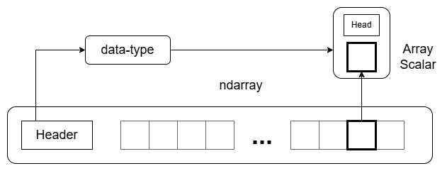

```
    arr = numpy.array([[1, 2, 3, 4], [5, 6, 7, 8], [9, 10, 11, 12], [13, 14, 15, 16]])
    assert (arr[1, 2:4] == [7, 8]).all()
    assert (arr[:, 1] == [2, 6, 10, 14]).all()
    assert (arr[2:, 2:] == [[11, 12], [15, 16]]).all()
    assert (arr[1::2, ::2] == [[5, 7], [13, 15]]).all()
```

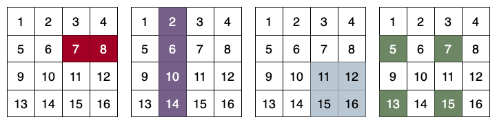

使用传统解法和机器学习解法，求一条通过 100 个随机分布点的最佳拟合直线，即找到一条直线 `y = m * x + b` 使得所有的点到直线的垂直距离之和（或平方和）最小。  

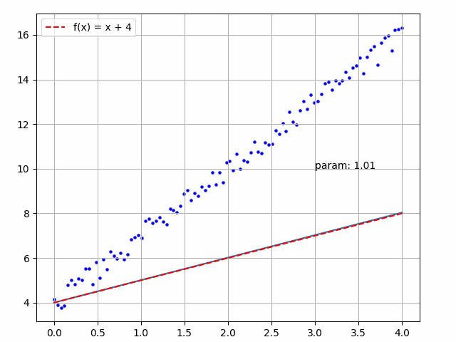

### 02 深度学习原理

了解机器学习与传统编程的区别，理解深度学习原理，熟悉人工神经网络的训练过程，包括数据预处理、神经元、权重、损失函数、优化器、反向传播等概念。  

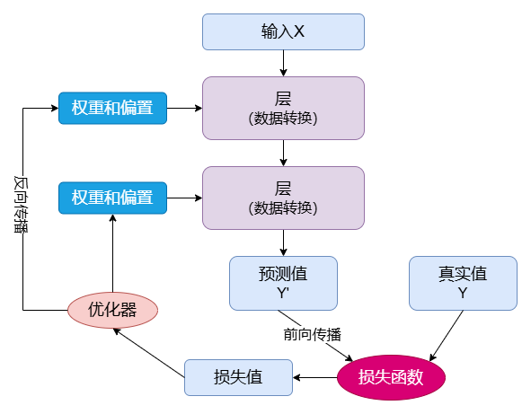

教材《线性代数介绍》深入浅出地介绍了线性代数的核心概念，包括矩阵运算、向量空间、线性变换、正交性、特征值与特征向量等。  

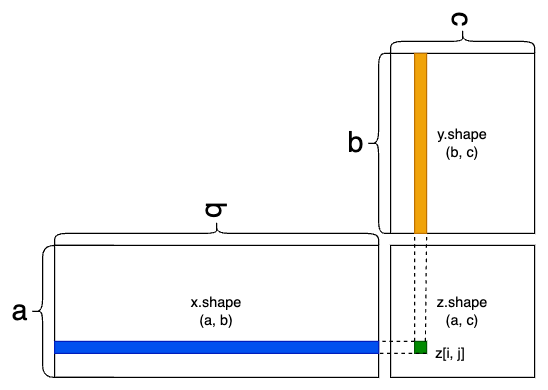

将日常生活中的常见表示（特征数据、文字、图片、视频、声音）转换为神经网络的数据输入，对数据进行一些预处理操作，手动实现常见的数据处理算法。  

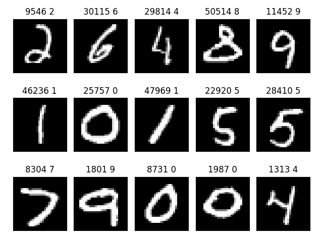

### 03 分类问题：Keras 求解

介绍统计学的基础知识，包括采样、数据统计、概率、正态分布等。使用标准正态函数，生成分类问题的随机分布点。  

二分类问题是指在机器学习或统计学中，将数据划分为两个类别的分类任务。常见的二分类问题包括垃圾邮件分类（垃圾邮件与正常邮件）、疾病诊断（有病与无病）、图像分类（有目标与无目标）等。  

```
    rng = numpy.random.default_rng(seed=0)
    input = rng.standard_normal((200, 2))
    output = numpy.array([1 if x + y > 0 else 0 for x, y in input])
    model = keras.Sequential()
    model.add(keras.layers.Input(shape=(2,)))
    model.add(keras.layers.Dense(units=1, activation='sigmoid',
                                 kernel_initializer=initializers.Constant(0.0),
                                 bias_initializer=initializers.Constant(1.0)))
    model.summary()
    model.compile(loss='binary_crossentropy',
                  optimizer=optimizers.Adam(learning_rate=0.01), metrics=['accuracy'])
    model.fit(input, output, epochs=5, batch_size=1)
```

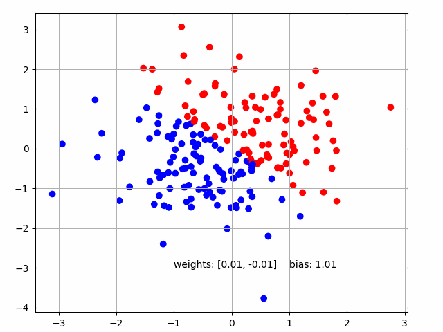

多分类问题是机器学习中的一个常见任务，其目标是将输入数据分配到多个类别中的一个。例如给定一张图片，模型需要判断图片中的内容是猫、狗还是鸟。  

```
    (x_train, y_train), (x_test, y_test) = keras.datasets.mnist.load_data()
    x_train, x_test = x_train / 255.0, x_test / 255.0
    model = keras.models.Sequential([
        keras.layers.Input(shape=(28, 28)),
        keras.layers.Flatten(),
        keras.layers.Dense(64, activation='relu'),
        keras.layers.Dense(10, activation='softmax')
    ])
    model.summary()
    model.compile(optimizer='adam',
                  loss=keras.losses.SparseCategoricalCrossentropy(),
                  metrics=['accuracy'])
    model.fit(x_train, y_train)
    model.evaluate(x_test, y_test)
```

本章主要使用 Keras 高级 API 来解决以上两个问题，进一步熟悉深度学习中常见的模块，包括模型、层、损失函数、优化器等。通过快速上手简单的示例，理解深度学习全流程，为后续详细介绍奠定基础。  

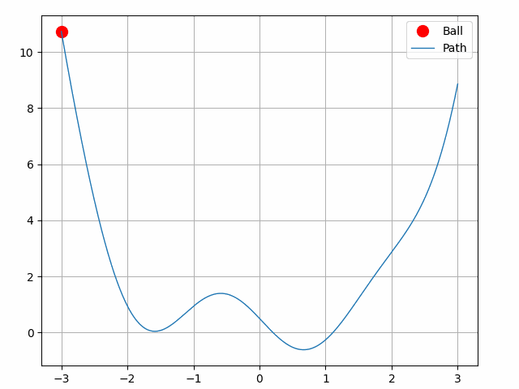

### 04 详解反向传播算法

复习导数（求微分）、链式法则、极值、偏导数等数学概念。通过 `NumPy` 实现常见的激活函数和损失函数，并求解它们的导数。使用链式法则求解模型的梯度，理解权重是如何更新的。  

```
    def binary_cross_entropy(y_pred, y_true):
        return -(y_true * numpy.log(y_pred) + (1 - y_true) * numpy.log(1 - y_pred))

    def deriv_binary_cross_entry(y_pred, y_true):
        return y_pred - y_true
```

手写全连接神经网络 (Dense Neural Network, DNN) ，理解网络的训练过程，即求复合函数 `h(g(f(weights, biases)))` 的极值（极大或极小），实现几个简单的模型。  


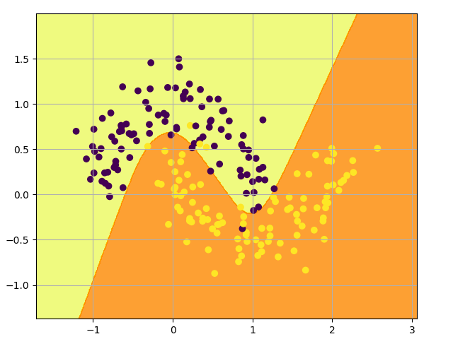

### 05 张量和自动微分

介绍主流机器学习库 (TensorFlow/PyTorch/JAX) 的核心内容：张量和自动微分。张量是机器学习中的一种核心数据结构，它可以看作是多维数组。自动微分是机器学习库用来自动计算梯度的工具。  

```
    w = tensorflow.Variable(tensorflow.fill((3, 2), 0.1), name='w')
    b = tensorflow.Variable(tensorflow.zeros(2, dtype=tensorflow.float32), name='b')
    x = [[1.0, 2.0, 3.0]]
    with tensorflow.GradientTape(persistent=True) as tape:
        y = tensorflow.math.tanh(tensorflow.matmul(x, w) + b)
        loss = tensorflow.reduce_mean(y * y)
    [dl_dw, dl_db] = tape.gradient(loss, [w, b])
```
```
    w = torch.nn.Parameter(torch.full((3, 2), 0.1))
    b = torch.nn.Parameter(torch.zeros(2))
    x = torch.tensor([[1.0, 2.0, 3.0]])
    with torch.autograd.set_grad_enabled(True):
        y = torch.tanh(torch.matmul(x, w) + b)
        loss = torch.mean(y * y)
    loss.backward()
    dl_dw, dl_db = w.grad, b.grad
```
```
    w = jax.numpy.full((3, 2), 0.1)
    b = jax.numpy.zeros(2)
    x = jax.numpy.array([[1.0, 2.0, 3.0]])
    def forward(x, w, b):
        y = jax.numpy.tanh(jax.numpy.dot(x, w) + b)
        return jax.numpy.mean(y * y)
    grads = jax.grad(forward, argnums=(1, 2))(x, w, b)
    dl_dw, dl_db = grads
```

实现一个对标量值进行自动求导的神经网络引擎 `micrograd` ，它主要用于构建简单的神经网络并计算梯度，使用它构建深度神经网络，进行二分类展示。  

分析 `tinygrad` 源码，不仅是教育目的（理解深度学习框架的底层原理），相比 micrograd 还增加了多维张量支持和更丰富的功能，使其接近实际深度学习框架的核心工作方式。  

### 06 训练神经网络

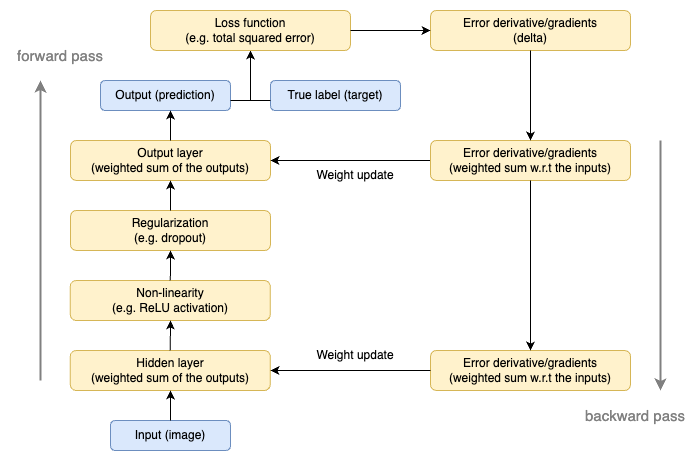

### 07 卷积神经网络

卷积神经网络 (Convolutional Neural Network, CNN) 是一类主要用于图像处理的深度学习模型，擅长提取图像的空间特征和模式。CNN 是现代计算机视觉领域的核心模型之一，广泛应用于图像分类、目标检测、语义分割等任务。  

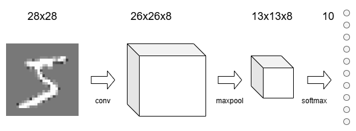

卷积神经网络主要包括卷积层和池化层。卷积层通过滑动卷积核对输入进行加权求和，提取局部特征，如边缘或纹理。池化层则通过选择局部区域的最大值或平均值，减少图像的尺寸。  

论文 _ImageNet Classification with Deep Convolutional Neural Networks_ 使用 ReLU 激活函数，利用 GPU 加速训练，证明深度学习在大规模图像数据上的潜力，成为现代深度学习崛起的里程碑。  

论文 _U-Net: Convolutional Networks for Biomedical Image Segmentation_ 采用对称的编码-解码结构，提出了有效的小样本训练方法。它广泛应用于医学图像分析领域，例如肿瘤检测、器官分割等任务。  

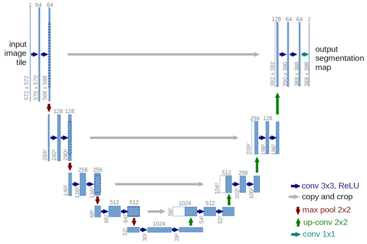

论文 _Deep Residual Learning for Image Recognition_ 使用残差模块，使网络深度达到数百甚至上千层，同时提升性能，成为深度网络的基础架构。  

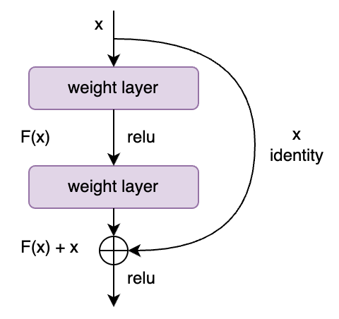

通过翻译论文的方式，可以清晰地展现深度学习从基础到深入的发展历程及其在各领域的应用，为后续学习更复杂的神经网络奠定坚实的理论基础。

### 08 循环神经网络

循环神经网络 (Recurrent Neural Network, RNN) 是一种用于处理序列数据的神经网络架构，与传统的前馈神经网络不同，RNN 在每一时刻的输出不仅依赖当前输入，还依赖于前一时刻的隐藏状态，从而能够捕捉序列中的时间依赖关系。  

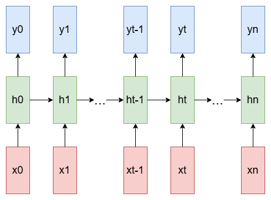

将常规循环网络 (RNN) 扩展成为双向循环网络 (Bidirectional Recurrent Neural Network, BRNN) 。BRNN 的训练不受输入信息的限制，这是通过同时在正负时间方向上进行训练来实现的。

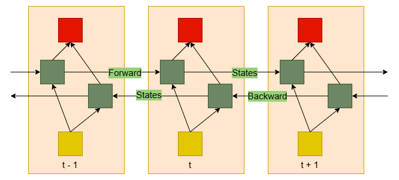

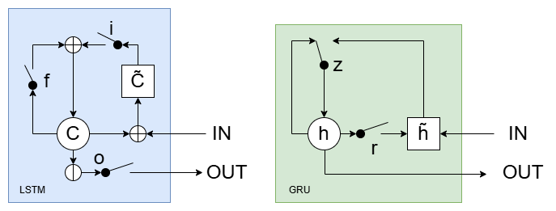


### 09 Transformer 架构

在计算机科学的注意力机制中，查询 (Query) 、键 (Key) 和值 (value) 的核心思想是模仿人类的注意力机制来动态选择重要信息。主动注意对应的是 Query 的作用，被动注意对应的是 Key 的显著性作用。

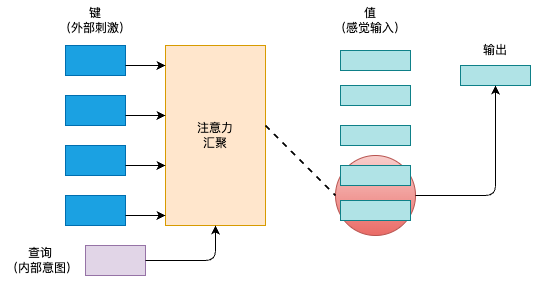

查询和键之间的交互形成了注意力汇聚，注意力汇聚有选择地聚合了值以生成最终的输出。通常两种交互方式：加性注意力和缩放点积注意力，它们被称为注意力评分函数。

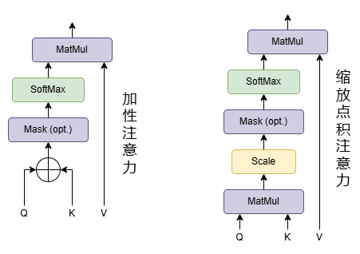

认识它和前馈网络的不同之处。翻译著名论文 _Attention Is All You Need_ ，并作出详细的解释，彻底理解 `Transformer` 架构。

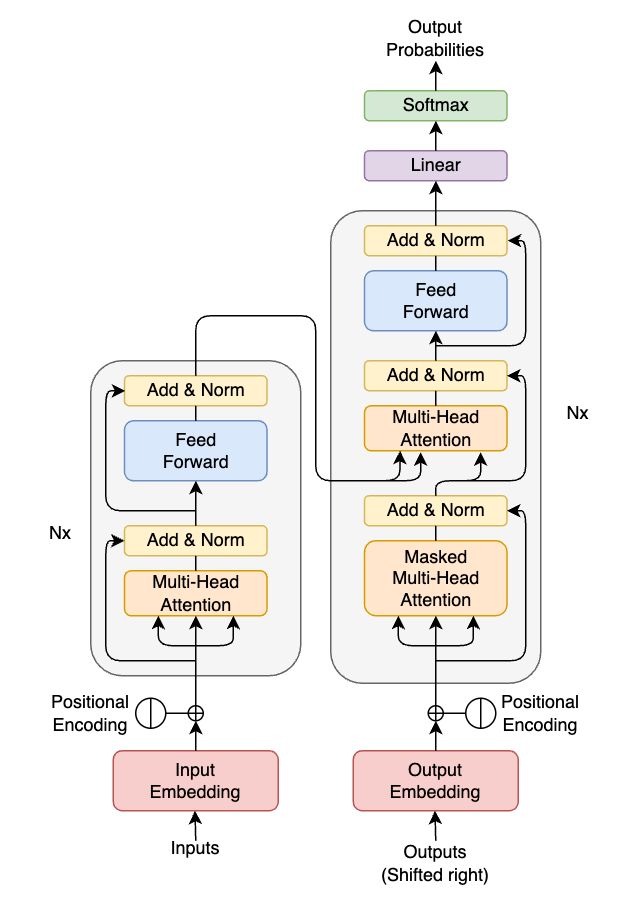

### 10 生成式 (Generative)

生成式方法的目标是在已知的样本数据上学习其特征分布，然后生成具有相似特征的全新数据，包括：稳定扩撒、神经风格迁移、DeepDream、卷积生成对抗网络、Pix2Pix 、CycleGAN 。

生成对抗网络 (Generative Adversarial Networks, GANs) 通过对抗过程训练两个网络，生成器 (Generator) 学习创建看起来真实的图像，而鉴别器 (Discriminator) 学习区分真实图像和假图像。  

### 11 大语言模型 (LLM)

`nanoGPT` 是最简单、最快的中型 GPT 训练/微调存储库，优先考虑实用性而非教育性。介绍 Llama 开源模型，包括如何访问模型、托管、操作方法和集成指南。

### 12 前沿探索

---

## 📖 [Python 语言 12 天速成](https://docs.google.com/document/d/13dJIhnj4FbxFApRbaxyYz436vsRMAK9FhqPyuqBMY9Q/edit?usp=sharing)

[ [在线文档](https://docs.google.com/document/d/13dJIhnj4FbxFApRbaxyYz436vsRMAK9FhqPyuqBMY9Q/edit?usp=sharing) ] [ [YouTube 视频](https://www.youtube.com/@machine-learning-series) ]

---
